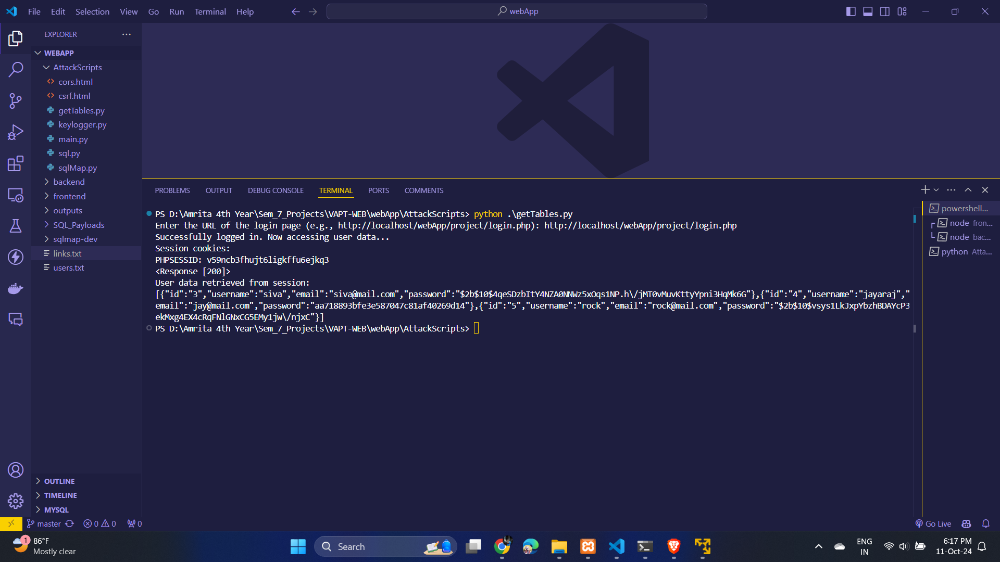

# Vulnerable Web Application and Secure React.js Application

## Overview

This repository contains two web applications: a **Vulnerable Web Application** designed to demonstrate various web vulnerabilities, and a **Secure React.js Application** that implements security best practices to mitigate these vulnerabilities. 

The goal of this project is to educate developers and security professionals about common security flaws in web applications and how to effectively address them.

---

## Table of Contents

- [Vulnerable Web Application and Secure React.js Application](#vulnerable-web-application-and-secure-reactjs-application)
  - [Overview](#overview)
  - [Table of Contents](#table-of-contents)
  - [Vulnerable Web Application](#vulnerable-web-application)
    - [Vulnerabilities](#vulnerabilities)
    - [Screenshots](#screenshots)
  - [Secure React.js Application](#secure-reactjs-application)
    - [Security Features](#security-features)

---

## Vulnerable Web Application

### Vulnerabilities

The following vulnerabilities are implemented in the vulnerable web application:

1. **SQL Injection**  
   A technique where an attacker can execute arbitrary SQL code on the database, potentially allowing unauthorized access to sensitive data.

2. **Session ID Retrieval**  
   Exposes session IDs through various means, allowing attackers to hijack user sessions.

3. **MD5 Cracking**  
   Demonstrates the weakness of MD5 hashing and how it can be cracked to reveal sensitive information.

4. **Cross-Site Scripting (XSS)**  
   Allows attackers to inject malicious scripts into webpages viewed by other users, leading to data theft or account compromise.

5. **Cross-Origin Resource Sharing (CORS)**  
   Misconfigured CORS policies can allow unauthorized domains to access resources.

6. **Cross-Site Request Forgery (CSRF)**  
   Tricks the user into executing unwanted actions on a different website where they are authenticated.

7. **Keylogger**  
   Captures keystrokes from users, potentially revealing sensitive information such as passwords.

---

### Screenshots

Here are some screenshots demonstrating each vulnerability:

- **SQL Injection**  
  

- **Session ID Retrieval**  
  

- **MD5 Cracking**  
  

- **Cross-Site Scripting (XSS)**  
  

- **Cross-Origin Resource Sharing (CORS)**  
  

- **Cross-Site Request Forgery (CSRF)**  

- **Keylogger**  
  

---

## Secure React.js Application

The Secure React.js application showcases security best practices and mitigations against the vulnerabilities listed above.

### Security Features

- **Prepared Statements**: Protects against SQL Injection by using prepared statements for database queries.
- **Secure Session Management**: Properly manages session IDs and uses secure cookies to protect user sessions.
- **Strong Hashing Algorithms**: Implements stronger hashing algorithms (e.g., bcrypt) instead of MD5.
- **Input Validation and Sanitization**: Prevents XSS by validating and sanitizing user inputs.
- **CORS Configuration**: Properly configures CORS policies to limit access to trusted domains.
- **CSRF Tokens**: Implements CSRF tokens to protect against CSRF attacks.
- **Keystroke Capture Prevention**: Uses security measures to prevent keylogging.

---